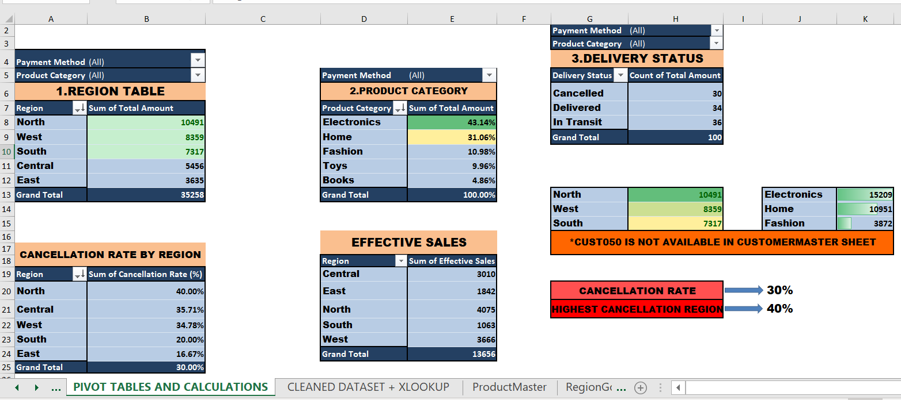

# Amazon-sales-excel-dashboard
An interactive Excel-based data analysis and dashboard project evaluating order transactions, customer segments, regional targets, and logistical performance for Amazon e-commerce sales.
## 📊 Project Overview

Key transformations and feature engineering techniques applied:
Data Integration (XLOOKUP): Utilized to map Customer Name from the Customer Master and Product Category from the Product Master into the central transactions sheet using IDs.

Logistics Tracking: Calculated Delivery Time (in days) using basic date metrics
                                    Delivery Time = Delivery Date - Order Date

Performance Classification: Segmented shipping performance conditionally using IF statements to tag fast-tracked orders (Delivery Performance = "Fast").

Financial Filtering: Built out metrics for Effective Sales to isolate successful financial income streams from cancelled orders, ensuring accounting accuracy:
                  Effective Sales = IF(Delivery Status = "Cancelled", 0, Total Amount)
                  
Total Gross Sales Revenue: ₹35,258 Total 

Effective Revenue (Excluding Cancellations): ₹13,656 Total 

Transaction Volume: 100 Orders

Geographical Footprint: Operations tracked across 5 major regions (Central, East, North, South, West).

Product Assortment: Revenue mapped across 5 core retail categories (Books, Electronics, Fashion, Home, Toys).

Key Insights from Pivot TablesRegional Standouts: The North region leads overall gross volume generation with ₹10,491 in sales, followed closely by the West region at ₹8,359.

Category Dominance: Electronics stands out as the largest single driver of revenue share, capturing approximately 43.14% of total sales. Home goods represent the second highest share at 31.06%.

Fulfillment Performance: Average delivery turnaround holds steady at approximately 3.76 days, with critical operational ratios indicating steady fulfillment metrics.

This repository contains a comprehensive sales analysis project that demonstrates end-to-end data processing inside Microsoft Excel—spanning from raw relational data tables to fully structured analytical views and aggregated KPIs. 

By leveraging advanced Excel functions and Pivot Tables, the project tracks order logistics, evaluates delivery fulfillment speeds, and compares sales performance metrics across five different geographical regions against their preset sales targets.

### Pivot Table Summaries & Metrics


.png)


## 🗂️ Repository Structure
```text
├── data/
│   ├── customer_master.csv             # Customer profiles and demographic info
│   ├── product_master.csv              # Product catalog with cost pricing and categories
│   ├── region_goals.csv                # Sales performance targets per region
│   └── cleaned_dataset.csv             # Compiled transactional log with XLOOKUPs
├── analytics/
│   └── pivot_tables_and_calculations.csv # Extracted pivot summaries and metrics
└── Amazon_Sales_Dashboard.xlsx          # Main Excel Workbook containing the interactive dashboard
